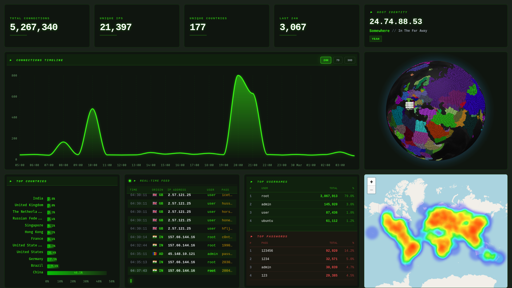

# geopot

Monitoring SSH login attempts and geolocating remote hosts who failed to login and gathering used credentials.



## How it works

The main idea is that you don't use default SSH port to connect to your remote server/VPS. This Docker Compose configuration maps fake server's port 22 to Docker host's public IP and stores unsuccesful login details in Postgres database:

| id    | ip_version | ip_address     | latitude  | longitude  | country_name | country_code | time_zone0 | zip_code | city_name | region_name | is_proxy | continent | continent_code | user | password  | timestamp                     |
|:-----:|:----------:|:--------------:|:---------:|:----------:|:------------:|:------------:|:----------:|:--------:|:---------:|:-----------:|:--------:|:---------:|:--------------:|:----:|:---------:|:-----------------------------:|
| 35086 | 4          | 180.101.88.252 | 31.311365 | 120.617691 | China        | CN           | +08:00     | 215003   | Suzhou    | Jiangsu     | false    | Asia      | AS             | root | nathalie  | 2024-02-28 14:31:56.356 +0100 |
| 35085 | 4          | 180.101.88.252 | 31.311365 | 120.617691 | China        | CN           | +08:00     | 215003   | Suzhou    | Jiangsu     | false    | Asia      | AS             | root | dfvgbh    | 2024-02-28 14:31:56.043 +0100 |
| 35084 | 4          | 180.101.88.252 | 31.311365 | 120.617691 | China        | CN           | +08:00     | 215003   | Suzhou    | Jiangsu     | false    | Asia      | AS             | root | jlo       | 2024-02-28 14:30:55.356 +0100 |
| 35083 | 4          | 180.101.88.252 | 31.311365 | 120.617691 | China        | CN           | +08:00     | 215003   | Suzhou    | Jiangsu     | false    | Asia      | AS             | root | egk       | 2024-02-28 14:30:53.744 +0100 |
| 35082 | 4          | 180.101.88.252 | 31.311365 | 120.617691 | China        | CN           | +08:00     | 215003   | Suzhou    | Jiangsu     | false    | Asia      | AS             | root | 1qaz2wsx@ | 2024-02-28 14:30:53.397 +0100 |

## Example usage

### Example `docker-compose.yml`

```yaml
name: geopot

services:

  geopot-timescaledb:
    image: timescale/timescaledb:latest-pg17
    container_name: geopot-timescaledb
    environment:
      - POSTGRES_DB=geopot
      - POSTGRES_USER=geopot
      - POSTGRES_PASSWORD=${POSTGRES_PASSWORD}
      - PGDATA=/pgdata
    volumes:
      - timescaledb_data:/pgdata
    restart: always

  geopot-valkey:
    image: valkey/valkey:latest
    container_name: geopot-valkey
    command: /bin/sh -c "redis-server --requirepass ${VALKEY_PASSWORD}"
    volumes:
      - valkey_data:/data
    restart: always

  geopot:
    image: ghcr.io/jsfraz/geopot:latest
    container_name: geopot
    depends_on:
      - geopot-timescaledb
      - geopot-valkey
    environment:
      - POSTGRES_USER=geopot
      - POSTGRES_PASSWORD=${POSTGRES_PASSWORD}
      - POSTGRES_SERVER=geopot-timescaledb
      - POSTGRES_PORT=5432
      - POSTGRES_DB=geopot
      - VALKEY_PASSWORD=${VALKEY_PASSWORD}
      - VALKEY_SERVER=geopot-valkey
      - VALKEY_PORT=6379
    ports:
      - "22:2222"
      - "127.0.0.1:8080:8080"
    volumes:
      - ./private_key.pem:/app/private_key.pem
    restart: always

networks:
  geopot:
    name: geopot

volumes:
  timescaledb_data:
  valkey_data:
```

### Example `.env` environmental variables

| Variable          | Description           |
|-------------------|-----------------------|
| POSTGRES_USER     | PostgreSQL user       |
| POSTGRES_PASSWORD | PostgreSQL password   |
| POSTGRES_SERVER   | PostgreSQL server     |
| POSTGRES_PORT     | PostgreSQL port       |
| POSTGRES_DB       | PostgreSQL database   |
| VALKEY_PASSWORD   | Valkey password       |
| VALKEY_SERVER     | Valkey server         |
| VALKEY_PORT       | Valkey port           |

### TODO Example nginx configuration

## Development

### Local build

```bash
sudo docker compose -f docker-compose.dev.yml --env-file .env.dev up -d --build
```

### Testing `localhost:2222`

```bash
./test.sh number_of_attempts
```
