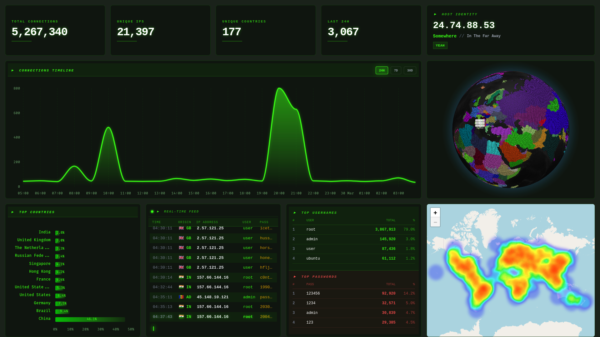

# geopot

Monitoring SSH login attempts and geolocating remote hosts who failed to login and gathering used credentials.



## How it works

The main idea is that you don't use default SSH port to connect to your remote server/VPS. This Docker Compose configuration maps fake server's port 22 to Docker host's public IP and stores unsuccesful login details in the database.

<!--
| id    | ip_version | ip_address     | latitude  | longitude  | country_name | country_code | time_zone0 | zip_code | city_name | region_name | is_proxy | continent | continent_code | user | password  | timestamp                     |
|:-----:|:----------:|:--------------:|:---------:|:----------:|:------------:|:------------:|:----------:|:--------:|:---------:|:-----------:|:--------:|:---------:|:--------------:|:----:|:---------:|:-----------------------------:|
| 35086 | 4          | 180.101.88.252 | 31.311365 | 120.617691 | China        | CN           | +08:00     | 215003   | Suzhou    | Jiangsu     | false    | Asia      | AS             | root | nathalie  | 2024-02-28 14:31:56.356 +0100 |
| 35085 | 4          | 180.101.88.252 | 31.311365 | 120.617691 | China        | CN           | +08:00     | 215003   | Suzhou    | Jiangsu     | false    | Asia      | AS             | root | dfvgbh    | 2024-02-28 14:31:56.043 +0100 |
| 35084 | 4          | 180.101.88.252 | 31.311365 | 120.617691 | China        | CN           | +08:00     | 215003   | Suzhou    | Jiangsu     | false    | Asia      | AS             | root | jlo       | 2024-02-28 14:30:55.356 +0100 |
| 35083 | 4          | 180.101.88.252 | 31.311365 | 120.617691 | China        | CN           | +08:00     | 215003   | Suzhou    | Jiangsu     | false    | Asia      | AS             | root | egk       | 2024-02-28 14:30:53.744 +0100 |
| 35082 | 4          | 180.101.88.252 | 31.311365 | 120.617691 | China        | CN           | +08:00     | 215003   | Suzhou    | Jiangsu     | false    | Asia      | AS             | root | 1qaz2wsx@ | 2024-02-28 14:30:53.397 +0100 |
-->

## Example usage

### Example `docker-compose.yml` (see [`docker-compose.example.yml`](docker-compose.example.yml))

Don't forget to generate `private_key.pem` first using following command:

```bash
openssl genrsa -out private_key.pem 4096
```

And build with `sudo docker compose up -d`!

For deploying behind a reverse proxy see [nginx configuration](geopot.conf).

### Example `.env` environmental variables  (see [`.env.example`](.env.example))

| Variable          | Description           |
|-------------------|-----------------------|
| GIN_MODE          | Production/debug mode |
| POSTGRES_USER     | PostgreSQL user       |
| POSTGRES_PASSWORD | PostgreSQL password   |
| POSTGRES_SERVER   | PostgreSQL server     |
| POSTGRES_PORT     | PostgreSQL port       |
| POSTGRES_DB       | PostgreSQL database   |
| VALKEY_PASSWORD   | Valkey password       |
| VALKEY_SERVER     | Valkey server         |
| VALKEY_PORT       | Valkey port           |

### TODO Example nginx configuration

## Development

### Local build

```bash
sudo docker compose -f docker-compose.dev.yml --env-file .env.dev up -d --build
```

### Testing `localhost:2222`

```bash
./test.sh number_of_attempts
```

### Swagger UI

Swagger UI is available at `http://localhost:8080/swagger` after starting development mode.
